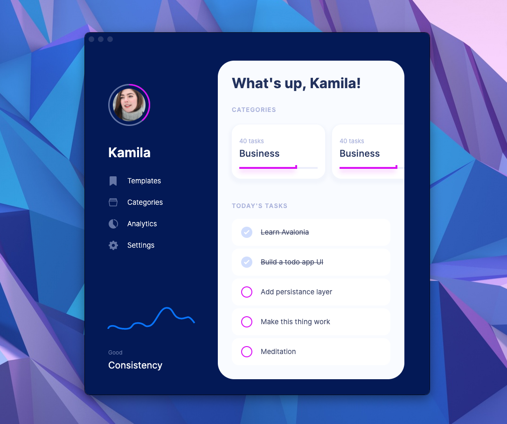

# PlayAvalonia
---
This is my AvaloniaUI "hello world".  
I wanted to mimic a [design I found on Dribble](https://dribbble.com/shots/14100356-ToDo-App-UI) and check how easy is to develop with Avalonia. 
Turns out this UI was fairly easy to do. 

Don't expect a real world application. It is just an experiment with a bunch of messy XAML and styles.

